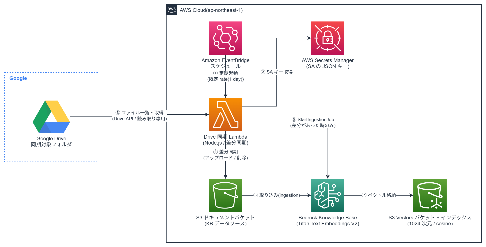
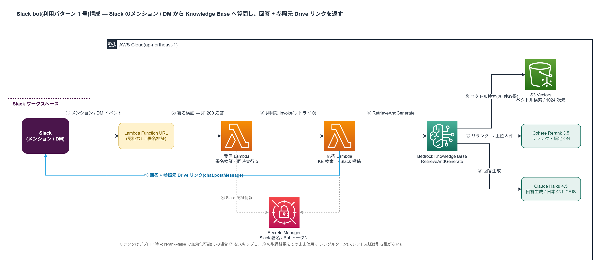

# bedrock-kb-gdrive-rag

Google Drive をデータソースとする Amazon Bedrock Knowledge Base(S3 Vectors)を
AWS CDK (TypeScript) で東京リージョン(ap-northeast-1)に構築する。Drive→S3 差分同期と
取り込み(ingestion)自動起動まで含む。

検索の試行だけなら、ナレッジベースさえ作れば
[Bedrock コンソール(東京)のナレッジベース画面](https://ap-northeast-1.console.aws.amazon.com/bedrock/home?region=ap-northeast-1#/knowledge-bases)
から対象 KB を開き、「ナレッジベースをテスト」でそのまま検索を試せる
(ベクトル検索のみの取得と、モデルを選んで回答生成させる RAG の両方が UI 上で実行できる)。

## 構成



- S3 ドキュメントバケット(同期先 / KB データソース)
- S3 Vectors バケット + インデックス(1024 次元 / cosine)
- Bedrock Knowledge Base(Titan Text Embeddings V2)+ S3 データソース(Fixed-size chunking)
- Drive 同期 Lambda(Node.js)+ Secrets Manager + EventBridge スケジュール

構成図のソースは [docs/architecture.drawio](docs/architecture.drawio)(draw.io で編集可能)。

## 前提

- Node.js 22 以上 / npm(Lambda ランタイムは Node.js 24)
- AWS CLI v2(未設定の場合は[構築手順の手順 0](docs/setup.md#0-aws-cli-の準備未設定の場合)を参照)
- Google アカウント(Gmail で可。GCP のセットアップはほぼ `gcloud` CLI だけで完結する)

## 構築手順

具体的な手順は **[docs/setup.md](docs/setup.md)** を参照。流れは以下のとおり:

0. AWS CLI の準備(未設定の場合)
1. GCP: サービスアカウントの作成と Drive API の有効化
2. Drive: 同期対象フォルダの共有とフォルダ ID の確認
3. AWS: Bedrock モデルアクセスの確認(通常は操作不要)
4. デプロイ(`cdk bootstrap` + `cdk deploy`)
5. デプロイ後の設定と初回同期(SA キーのシークレット投入 → Lambda 手動起動)
6. 動作確認(コンソールの「ナレッジベースをテスト」 / Retrieve API)

## 利用パターン(コンシューマ)

本リポジトリは「コア(KB 基盤)= 必須」+「利用パターン = 選択」の二層構成。
コアを構築したうえで、KB をどう呼び出して使うかは利用者が選択してデプロイする。

| パターン | スタック | 構築手順 |
| --- | --- | --- |
| Slack bot(メンション / DM で質問) | `SlackBotStack` | [docs/slack-setup.md](docs/slack-setup.md) |

### Slack bot



構成図のソースは [docs/slack-bot-architecture.drawio](docs/slack-bot-architecture.drawio)(draw.io で編集可能)。

```
Slack(メンション / DM)
  → Function URL → 受信 Lambda(署名検証・3 秒以内に応答)
  → 応答 Lambda(Bedrock RetrieveAndGenerate)
  → Slack へ回答 + 参照元(Drive リンク)を返信
```

- 生成モデルはデフォルトで Claude Haiku 4.5(日本ジオの推論プロファイル。
  東京⇔大阪で処理が完結)。`lib/config.ts` で差し替え可能。
- **アカウントで初めて使う際は Marketplace サブスクリプションの自動確定が必要**
  (Marketplace 権限を持つアイデンティティで一度 invoke する。確定前は
  「1 回目だけ成功し以降 `AccessDeniedException`」になりうる)。
  詳細は [docs/slack-setup.md の手順 7](docs/slack-setup.md)。
- 制約: シングルターン(スレッドの文脈は引き継がない)。Slack の at-least-once
  配送により、ごくまれに二重応答や(非同期起動失敗時の)無応答がありうる。

```bash
npx cdk deploy SlackBotStack -c driveFolderId=<対象フォルダID>
# リランクを無効にする場合(Cohere Rerank 3.5 のモデルアクセス不要)
npx cdk deploy SlackBotStack -c driveFolderId=<対象フォルダID> -c rerank=false
```

## 制約・注意事項

- **ファイル変換**: Google ドキュメント / スライド → PDF、スプレッドシート → CSV に
  エクスポートして同期する。それ以外の Google ネイティブ形式(フォーム等)はスキップ。
  通常ファイル(PDF / Word / テキスト等)はそのまま同期する。
- **エクスポート上限**: Drive の export API には約 10 MB の上限があり、これを超える
  **Google ドキュメント / スライド / スプレッドシート**はエクスポート(PDF/CSV 変換)に
  失敗する。なお通常ファイル(PDF / Word / テキスト等)は直接ダウンロードのため、
  この上限は適用されない(10 MB を超えても同期される)。
- **取り込み対象形式**: Bedrock KB が解釈できるのは PDF / TXT / MD / HTML / DOC(X) /
  CSV / XLS(X) 等。対象外形式のファイルが S3 にあると ingestion で失敗・スキップ扱いになる。
- **削除も同期される**: Drive 側で削除(ゴミ箱入り含む)したファイルは S3 からも削除される。
- **`cdk destroy` の挙動**: ドキュメントバケットは `RETAIN` のため削除されず残る。
  完全に消す場合はバケットを空にしてから手動で削除する。

## 既知の課題(ファイル増加時)

数百ファイル規模では問題ないが、対象フォルダのファイル数が増えると以下が顕在化しうる:

- **S3 一覧時の `HeadObject` N+1**: 同期 Lambda は差分判定のため、S3 オブジェクトごとに
  `HeadObject` を発行して `modifiedTime`(独自メタデータ)を取得している
  (`lambda/drive-sync/index.ts` の `listS3`)。`ListObjectsV2` は独自メタデータを返さない
  ための実装だが、オブジェクト数に比例して API 呼び出しと同期時間が増える。数千ファイル規模で
  Lambda の 15 分タイムアウトに近づく場合は、同期状態(キー → `modifiedTime`)を 1 つの
  マニフェスト JSON として S3 に置き、毎回 1 回の `GetObject` で読む方式への変更を検討する。
  - 補足: 安定キー(`<fileId>/<名前>`)にタイムスタンプを埋め込む案は、リネーム時の重複・
    削除検出を壊すため不可。状態は別管理(マニフェスト等)にするのが筋。

## コスト感(現構成のランニングコスト)

ap-northeast-1・小〜中規模(**数百ファイル / 1 日数十質問程度**)を前提とした概算。
正確な単価は変動するため、金額は目安であり最終的には各公式の料金ページで確認すること。
コストは「① ほぼ固定費」「② 同期の従量」「③ 質問 1 回あたりの従量」の 3 つに分かれる。

### ① ほぼ固定費(月額・利用量にほぼ依存しない)

| 項目 | コスト要因 | 目安 |
| --- | --- | --- |
| Secrets Manager | 保存シークレット数(SA キー等)× 約 $0.40/件・月 + API コール微少 | 月 $1 未満 |
| EventBridge スケジュール | ルール実行(1 日 1 回) | 実質ゼロ |
| S3(ドキュメントバケット) | 同期ファイルの保存容量(東京 約 $0.025/GB・月) | 数百ファイルなら月 $1 未満 |
| S3 Vectors(ベクトル保存) | ベクトル数 × 1024 次元 ×(float32=4B)の保存量 + 付随メタデータ | 数百ファイル → 数千チャンク規模なら月 $1 前後 |

→ **小規模なら固定費は月数ドル以内**に収まる。

### ② 同期の従量(EventBridge により 1 日 1 回起動)

| 項目 | コスト要因 | 目安 |
| --- | --- | --- |
| Drive 同期 Lambda | 実行回数(月 ≒ 30 回)× 実行時間 × 1024MB | 無料枠内に収まりやすい |
| Titan Text Embeddings V2 | **差分ファイルのみ**を取り込む際の入力トークン量(東京 従量) | 初回 ingestion 以外は小さい |

差分同期のため、**ファイルがほとんど変わらない日のコストはごくわずか**。
大量追加・初回取り込み時のみ Titan の埋め込みコストがまとまって発生する。

### ③ 質問 1 回あたりの従量(Slack bot 利用パターン)

1 質問で以下が 1 セット動く。

| 項目 | コスト要因 |
| --- | --- |
| receiver / worker Lambda | 短時間実行(256MB / 512MB)。少量なら無料枠内 |
| クエリの埋め込み(Titan V2) | 質問文のトークン量(数十トークン程度で僅少) |
| ベクトル検索(S3 Vectors) | クエリ 1 回分 |
| リランク(Cohere Rerank 3.5) | 検索 1 回・候補数十件分(ON 時のみ。`rerank=false` で無効化可) |
| 回答生成(Claude Haiku 4.5) | 入力 = 取得チャンク context + プロンプト、出力 = 回答 |

支配的なのは **回答生成(Haiku 4.5)** とリランク。Haiku 4.5 のトークン単価は
**入力 $1 / 出力 $5(いずれも 100 万トークンあたり)** が目安。
1 質問あたり入力数千トークン・出力数百トークン程度なら、**生成コストは 1 質問 1 円前後**のオーダー。
リランクを切ればその分の従量はゼロになる(回答精度とのトレードオフ)。

### コストを左右する主因とレバー

- **質問数**: ③ がそのまま線形に効く。大量利用ならここが主コスト。
- **取得チャンクサイズ / 件数**: Haiku への入力トークンを増やすので生成コストに直結
  (`CHUNK_MAX_TOKENS` / 取得件数。`lib/config.ts`)。
- **リランク ON/OFF**: `-c rerank=false` で Cohere の従量を停止できる(精度とのトレードオフ)。
- **ファイル変更頻度**: ② の Titan 埋め込みコストを左右する(差分のみ課金)。

> 単価の一次情報:
> [Amazon Bedrock 料金](https://aws.amazon.com/jp/bedrock/pricing/)(Titan 埋め込み・Cohere Rerank・Claude)/
> [Amazon S3 料金](https://aws.amazon.com/jp/s3/pricing/)(S3 Vectors 含む)/
> [AWS Lambda 料金](https://aws.amazon.com/jp/lambda/pricing/)。
> Bedrock 上の Claude の単価は first-party API と一致しない場合があるため、請求前に上記で要確認。

## 開発用コマンド

```bash
npm install              # 依存をインストール

npm test                 # Jest 単体テスト + CDK assertion テスト
npx tsc --noEmit         # 型チェック(ts-jest は transpile-only のためテストでは型検査しない)
npm run build            # TypeScript を dist/ にコンパイル

npx cdk synth  -c driveFolderId=<対象フォルダID>   # CloudFormation テンプレートを生成して確認
npx cdk diff   -c driveFolderId=<対象フォルダID>   # 既存スタックとの差分を確認
npx cdk deploy -c driveFolderId=<対象フォルダID>   # デプロイ
npx cdk destroy -c driveFolderId=<対象フォルダID>  # スタックを削除
```

> `driveFolderId` は全 CDK コマンドで必須(未指定だと即エラーで停止する)。`destroy` でも
> アプリの合成のため指定が要るが、削除動作自体には影響しない。

> メモ: 型安全は `npx tsc --noEmit` で担保している(`jest` は速度・メモリのため transpile-only)。
> CI などでは `npm test` と `npx tsc --noEmit` を併用すること。

## スコープ外(将来)

AgentCore 連携、マルチターン会話(スレッド文脈の引き継ぎ)、Slack 以外のチャット bot。

今後の発展方向(RAG 精度改善・機能追加・運用基盤の候補一覧)は
[docs/roadmap.md](docs/roadmap.md) にまとめている。
