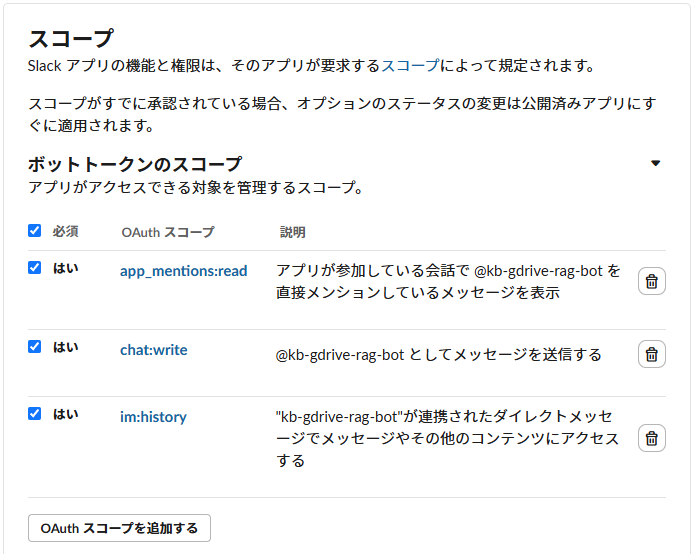
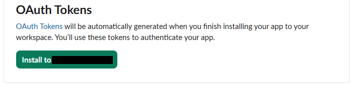
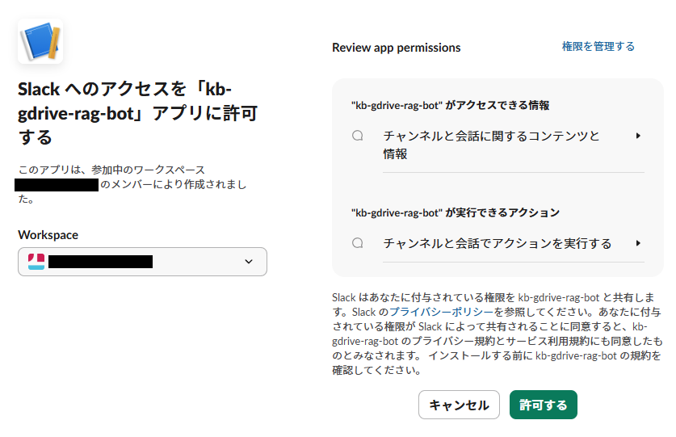
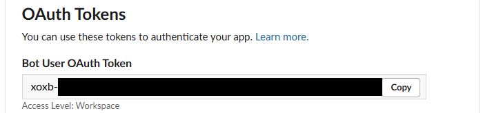
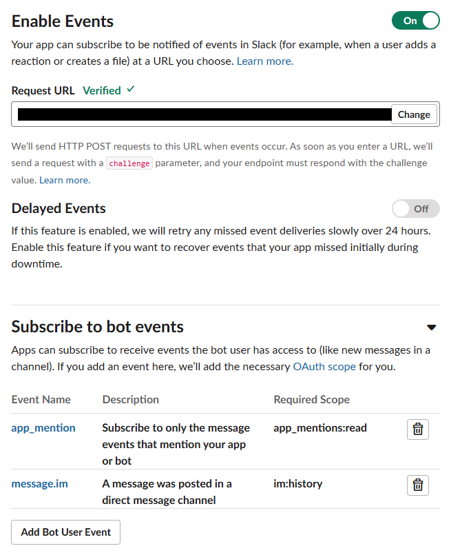
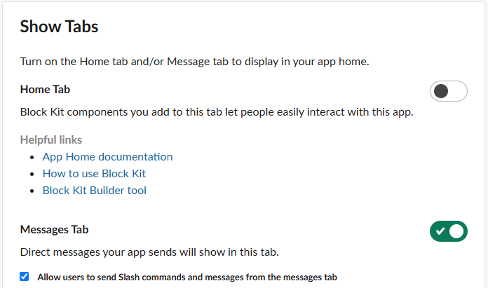

# Slack bot 構築手順

Slack のメンション / DM から Knowledge Base に質問できる bot のセットアップ手順。
コア(`KnowledgeBaseStack`)が構築済みであることが前提([docs/setup.md](setup.md))。

> 手順の順序が重要: **シークレット投入(手順 4)を終えてから Events URL を登録(手順 5)する**。
> URL 登録時に Slack が challenge 検証リクエストを送ってくるため、署名検証に使う
> signingSecret が先に入っていないと登録に失敗する。

## 1. Slack アプリの作成

1. [api.slack.com/apps](https://api.slack.com/apps) → **Create an App** → **From scratch**
2. アプリ名(例: `kb-gdrive-rag-bot`)と導入先ワークスペースを選んで作成
3. **Basic Information** → App Credentials の **Signing Secret** を控える

## 2. 権限(スコープ)の設定とインストール

1. **OAuth & Permissions** → Scopes → **Bot Token Scopes** に以下を追加:
   - `app_mentions:read`(メンションの受信)
   - `im:history`(DM の受信)
   - `chat:write`(返信の投稿)



2. ページ上部の **Install to Workspace** でインストールし、
   **Bot User OAuth Token**(`xoxb-` で始まる)を控える







## 3. デプロイ

```bash
npx cdk deploy SlackBotStack -c driveFolderId=<DriveのフォルダID>
```

出力された `SlackEventsUrl`(Function URL)を控える。`SlackSecretArn` も出力されるが、手順 4 はシークレット名で実行できるため控えなくてよい。

## 4. シークレットの投入

手順 1〜2 で控えた 2 つの値を Secrets Manager に投入する:

```bash
aws secretsmanager put-secret-value \
  --region ap-northeast-1 \
  --secret-id bedrock-kb-gdrive-slack-bot \
  --secret-string '{"signingSecret":"<Signing Secret>","botToken":"<xoxb-...>"}'
```

## 5. Events URL の登録とイベント購読

1. Slack アプリ設定の **Event Subscriptions** → Enable Events を **On**
2. **Request URL** に手順 3 の `SlackEventsUrl` を入力(Verified になることを確認)
3. **Subscribe to bot events** に以下を追加して保存:
   - `app_mention`
   - `message.im`



4. 保存後に再インストールを求められたら従う

## 6. DM を有効化

**App Home** → Show Tabs → **Messages Tab** を有効にし、
**Allow users to send Slash commands and messages from the messages tab** にチェック。



## 7. 生成モデルの初回サブスクリプション(アカウントで初回のみ)

現行の Bedrock に以前の「モデルアクセス画面で事前に有効化」する手順はない
(全モデルがデフォルトで利用可能)。代わりに、Anthropic などサードパーティモデルは
**アカウントで初めて invoke した時点で AWS Marketplace のサブスクリプションが自動的に開始**される。
この確定に失敗すると以降の呼び出しが `AccessDeniedException` になるため、動作確認の前に以下を満たしておく。

### 前提条件

1. **初回 invoke する IAM アイデンティティに Marketplace 権限があること**
   (自動サブスクリプションは呼び出し元の権限で実行される):

   ```json
   {
     "Effect": "Allow",
     "Action": [
       "aws-marketplace:Subscribe",
       "aws-marketplace:Unsubscribe",
       "aws-marketplace:ViewSubscriptions"
     ],
     "Resource": "*"
   }
   ```

2. **Anthropic のユースケースフォーム提出(アカウントまたは Organization で 1 回)** —
   Bedrock コンソールのモデルカタログで Anthropic モデルを選ぶとフォームが出る
   (または `aws bedrock put-use-case-for-model-access`)。提出すると即時で利用可能になる。
3. アカウントに有効な支払い方法が設定されていること。

### 手順と確認

上記を満たしたアイデンティティで一度 invoke すれば(プレイグラウンドでも CLI でも可)
サブスクリプションが確定する。確定後は**アカウント内の全アイデンティティ
(Lambda 実行ロールを含む)が Marketplace 権限なしで invoke できる**ため、
Lambda のロールに Marketplace 権限を足す必要はない。確定状態は次で確認できる:

```bash
aws bedrock get-foundation-model-availability \
  --region ap-northeast-1 \
  --model-id anthropic.claude-haiku-4-5-20251001-v1:0
# "agreementAvailability": {"status": "AVAILABLE"} なら確定済み
```

> **ハマりどころ**: サブスクリプション確定前の猶予期間(最大 15 分)は呼び出しが
> **一時的に成功する**ことがある。「1 回目は動いたのに 2 回目以降
> `AccessDeniedException`(aws-marketplace:Subscribe ... not authorized)になる」場合は、
> 呼び出し元の Marketplace 権限不足で確定に失敗している。権限を付与して再度 invoke し、
> 反映まで 2 分ほど待つ。

## 8. 動作確認

- チャンネルに bot を招待(`/invite @<bot名>`)して `@<bot名> <質問>` でメンション →
  スレッドに回答 + 参照元(Drive リンク)が返る
- bot との DM で質問 → 通常メッセージで回答が返る
- 応答しない場合は受信/応答 Lambda の CloudWatch Logs を確認する

## 制約

- **シングルターン**: スレッドで追い質問しても文脈は引き継がれない
- **まれな二重応答 / 無応答**: Slack の at-least-once 配送と非同期起動失敗により、
  ごくまれに発生しうる(詳細は README の既知の制約)
